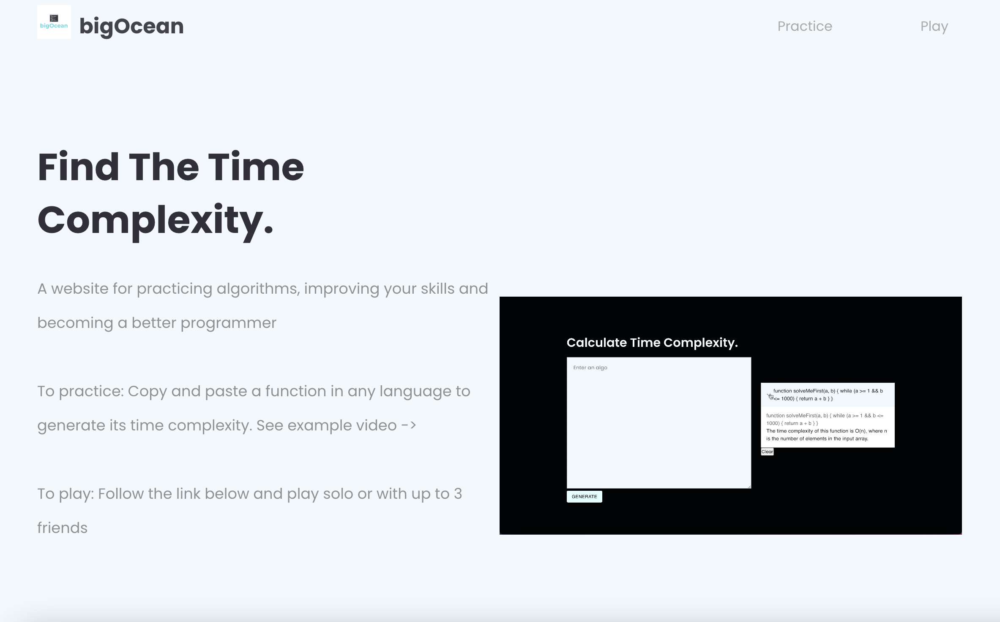

<!-- PROJECT LOGO -->

    

  <h3 align="center">bigOcean - OpenAI</h3>

  

    OpenAI | GPT-3
     
    <a href="https://big0cean.herokuapp.com/">View Demo</a>
  

## Functionality

<strong>Functionality includes:</strong>
* Type or paste a prompt (a function) in the input element
* The form sends the prompt to the OpenAI API
* The results are sent in a list (accordion), sorted from newest to oldest
* The list can be cleared by the click of a button
* A link to an algorithm game can be clicked if user wants to play

## Technologies
* OpenAI
* React
* Material UI

## Notes
<strong>Problems</strong>
* Heroku build fail - "Javascript heap out of memory"
  - I cleaned up my code and removed any unnecessary loops
  - I replaced my .mov files to .mp4 files
* Inactive Heroku apps need longer time to load
* Screen recording of app?
* The git repository has the original name of 'thedailyprompt'
  - I did not want to change this for fear of crashing the app

<strong>Improvements</strong>
* Make mobile friendly
* Add mobile icon bars at top to display menu depending on screen size

<strong>Extras Added</strong>
* Persistence - Saved responses if the user leaves or reloads the page
* Made the app more specific to a single purpose (algos)

## Contact Me (Junior Developer)

Asia Thomas - amthoms2@gmail.com
<a href="https://www.linkedin.com/in/amthoms2/">LinkedIn</a>

<!-- ACKNOWLEDGEMENTS -->
## Acknowledgements
* Free Logo Design-> https://www.freelogodesign.org/
